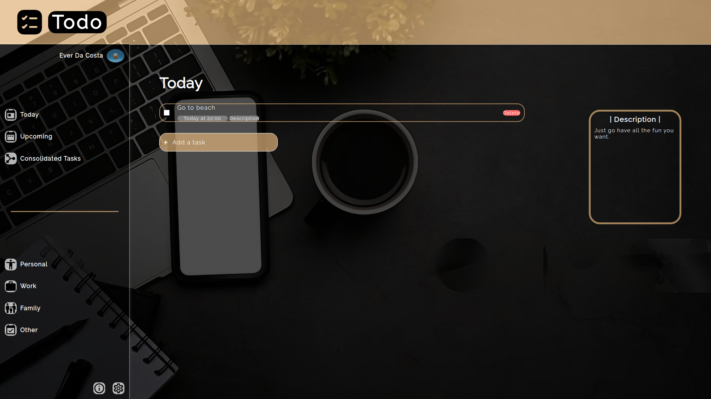

# Todo List App

    <h3>💻 Technologies</h3>
    
    
    
    
    
    
    
    <h4><a href="https://asdacosta.github.io/todo-list/">Live Preview</a></h4>

**Demo:**

**
Screen views
**

**Desktop View:**

 

**Mobile View:**

Yet to

## 🌐 Origin
[The Odin Project](https://www.theodinproject.com/)

## 📝 Description
Builds a todo list web application.

Features

* Create and delete tasks effortlessly.
* Set deadlines for tasks.
* Add description to tasks.
* Sort task in any category.
* Check a task to indicate as done.
* Maximum of 5 tasks per section.
* Choose different background colors in Settings.
* Throw error for empty task or past date/time.

## 🎯 Relevance
To solidify concepts of `Object Oriented Programming (OOP) Principles`, particularly `SOLID Principles` in JavaScript. 

## 👥 Intended Audience
Developers, users, and non-developers.

> [!NOTE]
> Users can install all dependencies via `npm install` using `package.json` file.

## 📂 Files

Invert

| File | Description |
| - | - |
|`src/*`| Source files that are bundled into the output directory `dist/`.|
|`src/index.js`| The main JavaScript entry point that bundling begins.|
|`dist/*`| Output files from bundling of files in directory `src/`.|
|`dist/main.js`| Main JavaScript output file that contains the bundled JavaScript code. Code is minified and optimized for deployment (Due to mode set to production in webpack config). |
|`algorithm.txt`| Contains JavaScript algorithm for some few part of entire code.|
|`webpack.config.js`| Configuration file for webpack. It enables the bundling of different assets.|
|`package*`| Contains details of project and dependencies versions.|
|`readme-assets/*`| Live demo and different screen views used in `README.md`.|

## ©️ Credit

Invert

| File | Description |
| - | - |
|`src/imgs/checklist.png`| Icon created by Graphics Plazza on [Flaticon](https://www.flaticon.com/free-icons/).|
|`src/imgs/*.svg`| Icons from [Material Design Icons](https://pictogrammers.com/library/mdi/).|

## 🔄 Improvements

Invert

- [ ] Add date icon to be able to select date from calender.
- [ ] Add local storage for todos; continue in commented code in `src/storage.js`.
- [ ] Add edit icon to tasks. (Dialog should popup with contents and legend of Edit Task instead of task number)
- [ ] Make dialog have an exit 'X' at top to be able to cancel task. (You might need to replace dialog with another element, say div)
- [ ] When user returns to page, indicate previously selected color from local storage with border in settings. 
- [ ] Checked task should reflect in all categories it's in and it should be at the bottom. (Might need to replace checkbox input with 
 or another element and style as a check box).
- [ ] Add priority rank in form and indicate it on the task with a small box.
- [ ] Make website responsive in all screen sizes.
- [ ] Add a choice in settings to pick a random color for user.

## 👤 Curator
1. [Abraham Da Costa Silvanus](https://github.com/asdacosta) 

**[🞁 Top](#todo-list-app)**
